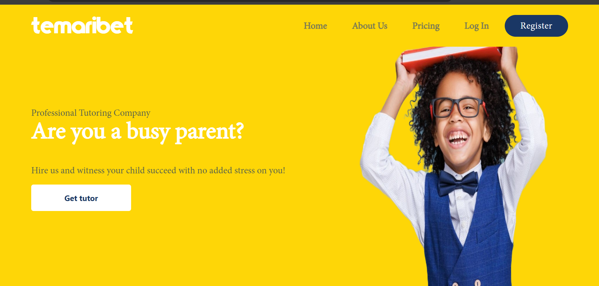

# Temaribet Frontend

## Overview

This repository hosts the frontend for [Temaribet](https://temaribet.net/), a professional tutoring platform based in Addis Ababa, Ethiopia. Temaribet connects parents and students with highly qualified tutors, making personalized learning accessible, efficient, and stress-free for busy parents, ensuring academic success for children.

### Homepage

Below is a screenshot of the homepage of Temaribet:



## Tech Stack

- **Frontend Framework**: [Next.js](https://nextjs.org/)
- **Styling**: [TailwindCSS](https://tailwindcss.com/)
- **Database**: [Firebase](https://firebase.google.com/)
- **State Management**: [Redux](https://redux.js.org/)
- **API Integration**: Fetch API

---

## Project Structure

```plaintext
tts/
├── backend-utils/      # Utilities for API interactions and backend services
├── components/         # Reusable UI components (e.g., buttons, cards, modals)
├── pages/              # Next.js pages for routing
├── public/             # Static assets like images and icons
├── redux/              # Redux slices and store setup
├── styles/             # Global and component-specific styles
├── themes/             # Theme configuration for light/dark modes
├── utils/              # Helper functions for Firebase, and formatting.
├── views/              # High-level views for different pages or workflows
│   └── completeProfile/ # Complete profile page components and logic
└── README.md           # Documentation
```

## Setup Instructions

### Prerequisites

- Install [Node.js](https://nodejs.org/) (v6 or later recommended).
- Install [npm](https://www.npmjs.com/).

### Steps

1. **Clone the repository**:

   ```bash
   git clone https://github.com/habasefa/tts.git
   ```

2. **Navigate to the project directory**:

   ```bash
   cd tts
   ```

3. **Install dependencies**:
   ```bash
   npm install
   ```
4. **Run the development server**:

   ```bash

   npm run dev
   ```

5. **Access the application**:
   The application will be accessible at [http://localhost:3000](http://localhost:3000).
